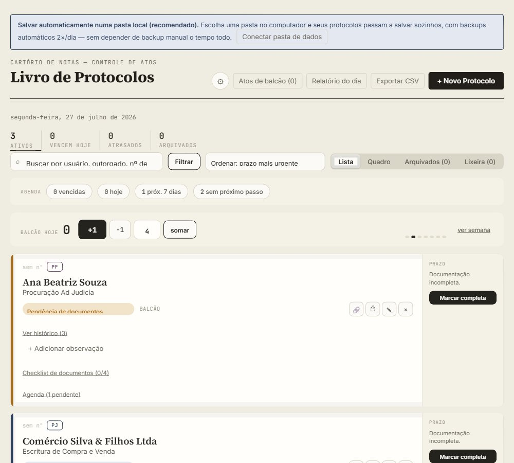
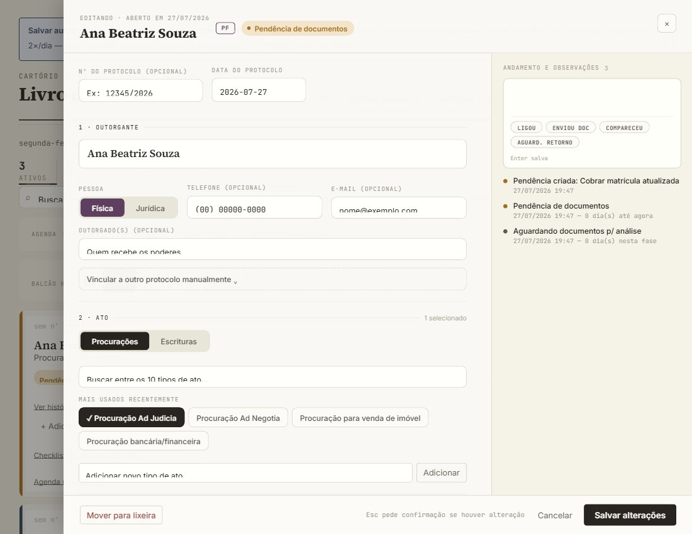

# Livro de Protocolos — Controle de Atos

Ferramenta de controle de protocolos de atos notariais (procurações públicas e
escrituras) pra cartório de notas. Acompanha prazo, status de andamento, vínculos
entre protocolos, checklist de documentos e agenda de pendências — tudo num único
arquivo HTML, sem servidor, sem instalação.

**Usar agora**: https://fabricio-lv.github.io/controle-atos-cartorio/

## Sobre os dados: código público, dados sempre locais

Este repositório é público, mas os dados dos protocolos **nunca saem do computador
de quem usa**. Não há banco de dados remoto nem envio de informação pra nenhum
servidor (nem pro GitHub) — o código é só a ferramenta; os dados de cliente ficam:

- numa pasta local escolhida pelo usuário, com backup automático 2×/dia; ou
- no armazenamento do próprio navegador, com backup manual em `.json` como rede de
  segurança.

Isso é proposital, por sigilo profissional/LGPD.

## O que a ferramenta faz

- **Lista e Quadro (Kanban)** de protocolos, com prazo calculado automaticamente
  (5 dias úteis a partir da documentação completa, descontando fins de semana e
  feriados).
- **PF/PJ**, canais de atendimento, responsável interno, vínculo manual entre
  protocolos.
- **Tipos de ato** organizados por categoria (Procurações / Escrituras), com
  checklist de documentos próprio por tipo.
- **Agenda de pendências**: próximos passos por protocolo, com faixa compacta
  mostrando vencidas, hoje, próximos 7 dias úteis e protocolos sem próximo passo
  agendado.
- **Histórico unificado**: mudança de status, observações e pendências numa
  timeline só, por protocolo.
- **Lixeira** (nunca exclusão direta), atos de balcão (contador diário sem
  protocolo), relatório do dia, exportação CSV.

## Como usar

Abra o link acima — não precisa instalar nada. Na primeira vez, é recomendável
clicar em **"Conectar pasta de dados"** pra escolher uma pasta no seu computador: a
partir daí a ferramenta salva sozinha a cada mudança e faz backup automático 2×/dia.
Funciona no Chrome e no Edge; noutros navegadores, os dados ficam no armazenamento
local do navegador (com backup manual disponível em Configurações).

## Detalhes técnicos

Arquivo único (`controle-atos.html`), HTML + CSS + JS puro — sem framework, sem
build, sem dependências externas depois de carregado. Ver `CLAUDE.md` pra
arquitetura, modelo de dados e convenções de código.
